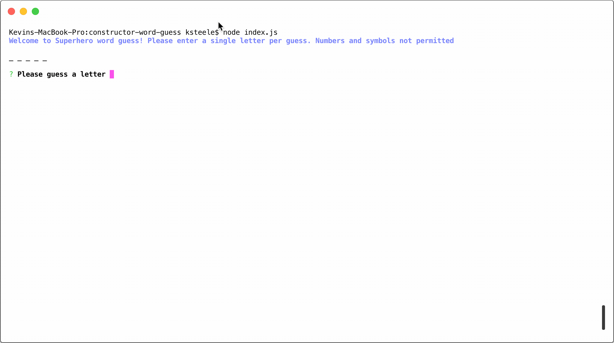

# Constructor Superhero Word Guess CLI Game

## Fully developed by Kevin Steele for GWU Full Stack Web Development BootCamp 

**Github repo**: https://github.com/kevdsteele/constructor-word-guess

### Dependencies

* **[Node.JS](https://nodejs.org/en/download/)** must be installed to run this application

> * [Chalk](https://www.npmjs.com/package/chalk), [Clear](https://www.npmjs.com/package/clear) , [Inquirer](https://www.npmjs.com/package/inquirer) and [Superheroes](https://www.npmjs.com/package/superheroes) node packages must also be installed before running this application*

* The Node **Superheroes** package is used to generate a randaom superhero name as the word to guess. 
* The Node **Inquirer** package is used to get the user input. 
* The Node **Chalk** package is used to provide color output to the console. 
* The Node **Clear** package clears the console after each game.

### This is an application that demonstrates how to use Javascript Construtors. It consist of three files:

> **index.js** Is the main file that consists of the primary game functions
> It requires the **words.js** file. 

* *initGame* Initializes the game each time it is played 

* *getGuess* Uses Inquirer to get the user guess

* *playGame* Is the main game logic

* *checkSolved* Checks to see if the word has been solved 

* *playAgain* Uses Inquirer to ask the user if they want to keep playing 

> **words.js** contains a Constructor that is responible for holding an array of letter objects and three functions. It requires the **letter.js** file. 

* A function named *createLetters* that calls upon the letter.js Contructor to create the letter object

* A function named *update* that calls upon the letter.js display function to update the word with either a guessed letter or a placeholder

* A function named *guess* which calls upon the letter.js check function to process the guessed letter 

> **letters.js** contains a Constructor that creates each letter object

* String value for each letter, space, hyphen or perion contained in the random superhero name 

* Placeholder string variable for the underscore character 

* A boolean value to indicate if the letter has been guessed 

* A function named *display* that shows the character of the placeholder 

* A function named *check* that compares the guess each character and updates to true when guessed 

## Demo 

## 1

